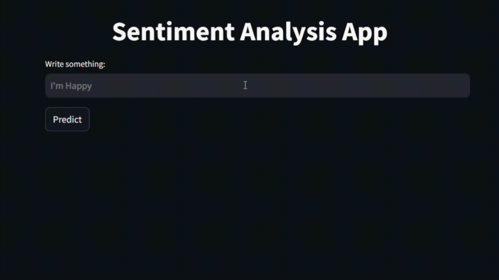

# Twitter Sentiment Analysis 



This is a simple Sentiment Analysis  application that classifies input text as either positive or negative. The app is built with **Streamlit** and uses a pre-trained machine learning model (Logistic Regression) on a Twitter dataset.

## Installation
1. Clone the repository:
   ```bash
   git clone https://github.com/dhia619/Twitter-Sentiment-Analysis
   cd Twitter-Sentiment-Analysis
   ```

2. Install requirements:
    ```bash
    pip install -r requirements.txt
    ```
   
## Usage

```bash
streamlit run app.py
```

